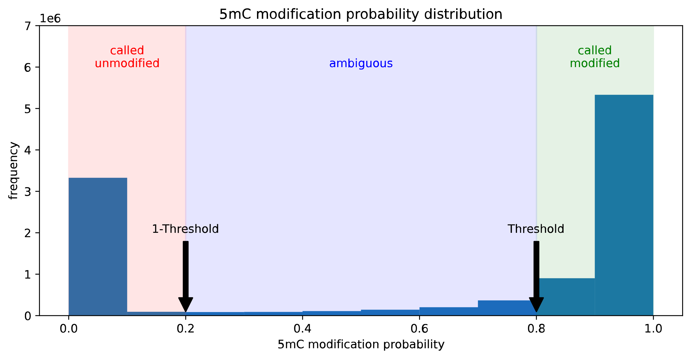
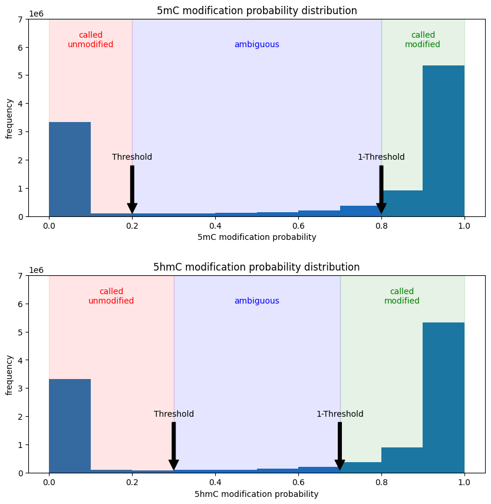

# minimod

minimod is a simple tool for handling base modifications. It takes an aligned BAM file with modifications tags and the reference FASTA as inputs, and outputs base modifications (TSV) or base modification frequencies (TSV or bedmethyl).

Minimod reads base modification information encoded under `MM:Z` and `ML:B:C` SAM tags specified in [SAMtags](https://github.com/samtools/hts-specs/blob/master/SAMtags.pdf) specification.

**IMPORTANT: minimod is currently in early development stage. So note that the interface, thresholds and defaults may change. Watch out for bugs and open an issue if you find one. This notice will be removed when things are stable and undergo more rigorous testing**

# Table of Contents
- [Installation](#installation)
  - [Building a release](#building-a-release)
- [Usage](#usage)
- [Examples](#examples)
- [minimod view](#minimod-view)
- [minimod mod-freq](#minimod-mod-freq)
- [Modification codes and contexts](#modification-codes-and-contexts)
- [Modification threshold](#modification-threshold)
<!-- - [Enable insertions](#enable-insertions)
- [Enable haplotypes](#enable-haplotypes) -->
- [Important !](#important)
  - [Base-calling](#base-calling)
  - [Aligning](#aligning)
- [Limitations / Future Improvements](#limitations--future-improvements)


# Installation
## Pre-requisites
```bash
sudo apt-get install zlib1g-dev  # install zlib development libraries
```
## Building a release
```bash
VERSION=v0.2.0
wget https://github.com/warp9seq/minimod/releases/download/$VERSION/minimod-$VERSION-release.tar.gz
tar xvf minimod-$VERSION-release.tar.gz 
cd minimod-$VERSION/
scripts/install-hts.sh  # download and compile the htslib
make
```

# Usage
Usage information can be printed using ```minimod -h``` command.
```bash
Usage: minimod <command> [options]

command:
         view          view base modifications
         mod-freq      output base modifications frequencies
```

# Examples
```bash
# view all 5mC methylations at CG context in tsv format (default mod code: m, context:CG)
minimod view ref.fa reads.bam > mods.tsv

# 5mC methylation frequencies at CG context in tsv format (default mod code: m, threshold: 0.8, context:CG)
minimod mod-freq ref.fa reads.bam > modfreqs.tsv

# 5mC methylation frequencies at CG context in bedmethyl format (default mod code: m, threshold: 0.8, context:CG)
minimod mod-freq -b ref.fa reads.bam > modfreqs.bedmethyl

# modification frequencies of multiple types ( m (5-methylcytosine) and h (5-hydroxymethylcytosine) in CG context with thresholds 0.8 and 0.7 respectively )
minimod mod-freq -c m[CG],h[CG] -m 0.8,0.7 ref.fa reads.bam > mods.tsv
```
- See [how modification codes can be specified?](#modification-codes-and-contexts)
- See [how threshold is used in minimod?](#modification-threshold)

# minimod view
```bash
minimod view ref.fa reads.bam > mods.tsv
```
This writes all base modifications (default modification code "m") to a file (mods.tsv) in tsv format. Sample output is given below.
```bash
Usage: minimod view ref.fa reads.bam

basic options:
   -c STR                     modification code(s) (eg. m, h) [m]
   -t INT                     number of processing threads [8]
   -K INT                     batch size (max number of reads loaded at once) [512]
   -B FLOAT[K/M/G]            max number of bases loaded at once [20.0M]
   -h                         help
   -p INT                     print progress every INT seconds (0: per batch) [0]
   -o FILE                    output file [stdout]
   --verbose INT              verbosity level [4]
   --version                  print version
```
   <!-- --insertions               enable modifications in insertions [no]
   --haplotypes               enable haplotype mode [no]
``` -->

- See [how to consider inserted modified bases?](#modified-bases-in-insertions)

**Sample mods.tsv output**
```bash
ref_contig	ref_pos	strand	read_id	read_pos	mod_code	mod_prob
chr22	19979864	+	m84088_230609_030819_s1/55512555/ccs	14	m	0.709804
chr22	19979882	+	m84088_230609_030819_s1/55512555/ccs	32	m	0.949020
chr22	19979885	+	m84088_230609_030819_s1/55512555/ccs	35	m	0.980392
chr22	19979888	+	m84088_230609_030819_s1/55512555/ccs	38	m	0.780392
chr22	19979900	+	m84088_230609_030819_s1/55512555/ccs	50	m	0.623529
chr22	19979902	+	m84088_230609_030819_s1/55512555/ccs	52	m	0.992157
chr22	19979929	+	m84088_230609_030819_s1/55512555/ccs	79	m	0.941176
chr22	19979939	+	m84088_230609_030819_s1/55512555/ccs	89	m	0.141176
chr22	19979948	+	m84088_230609_030819_s1/55512555/ccs	98	m	0.623529
```

| Field    | Type | Definition    |
|----------|-------------|-------------|
| 1. ref_contig | str | chromosome |
| 2. ref_pos   | int | position (0-based) of the base in reference |
| 3. strand | char | strand (+/-) of the read |
| 4. read_id | str | name of the read |
| 5. read_pos | int | position (0-based) of the base in read |
| 6. mod_code | char | base modification code as in [SAMtags: 1.7 Base modifications](https://github.com/samtools/hts-specs/blob/master/SAMtags.pdf)  |
| 7. mod_prob | float | probability (0.0-1.0) of base modification |
<!-- | 8. ins_offset | int | offset of inserted base from ref_pos (only output when --insertions is specified) |
| 9. haplotype | int | haplotype of the read (only output when --haplotypes is specified) | -->

# minimod mod-freq
```bash
minimod mod-freq ref.fa reads.bam > modfreqs.tsv
```
This writes base modification frequencies (default modification code "m" in CG context with modification threshold 0.8) to a file (modfreqs.tsv) file in tsv format.
```bash
Usage: minimod mod-freq ref.fa reads.bam

basic options:
   -b                         output in bedMethyl format [not set]
   -c STR                     modification codes (eg. m, h) [m]
   -m FLOAT                   min modification threshold(s). Comma separated values for each modification code given in -c [0.8]
   -t INT                     number of processing threads [8]
   -K INT                     batch size (max number of reads loaded at once) [512]
   -B FLOAT[K/M/G]            max number of bases loaded at once [20.0M]
   -h                         help
   -p INT                     print progress every INT seconds (0: per batch) [0]
   -o FILE                    output file [stdout]
   --verbose INT              verbosity level [4]
   --version                  print version
```
   <!-- --insertions               enable modifications in insertions [no]
   --haplotypes               enable haplotype mode [no]
``` -->

**Sample modfreqs.tsv output**
```bash
contig	start	end	strand	n_called	n_mod	freq	mod_code
chr22	20016337	20016337	+	5	0	0.000000	m
chr22	20016594	20016594	+	2	0	0.000000	m
chr22	20017045	20017045	+	1	0	0.000000	m
chr22	19970705	19970705	+	1	0	0.000000	m
chr22	19981716	19981716	+	1	1	1.000000	m
chr22	20020909	20020909	+	3	0	0.000000	m
chr22	19995719	19995719	+	4	2	0.500000	m
chr22	20017060	20017060	+	1	0	0.000000	m
chr22	19971259	19971259	+	1	1	1.000000	m
```
| Field    | Type | Definition    |
|----------|-------------|-------------|
| 1. contig | str | chromosome |
| 2. start | int | position (0-based, inclusive) of the base |
| 3. end   | int | position (0-based, inclusive) of the base |
| 4. strand | char | strand (+/-) of the read |
| 5. n_called | int | number of reads called for base modification |
| 6. n_mod | int | number of reads with base modification |
| 7. freq | float | n_mod/n_called ratio |
| 8. mod_code | char | base modification code as in [SAMtags: 1.7 Base modifications](https://github.com/samtools/hts-specs/blob/master/SAMtags.pdf) |
<!-- | 9. ins_offset | int | offset of inserted base from ref_pos (only output when --insertions is specified) |
| 10. haplotype | int | haplotype of the read (only output when --haplotypes is specified) | -->

**Sample modfreqs.bedmethyl output**
```bash
chr22	20016387	20016388	m	4	-	20016387	20016388	255,0,0	4	0.000000
chr22	20016820	20016821	m	1	+	20016820	20016821	255,0,0	1	0.000000
chr22	19999255	19999256	m	7	+	19999255	19999256	255,0,0	7	0.000000
chr22	20016426	20016427	m	1	+	20016426	20016427	255,0,0	1	100.000000
chr22	19988365	19988366	m	1	-	19988365	19988366	255,0,0	1	100.000000
chr22	19988168	19988169	m	1	-	19988168	19988169	255,0,0	1	100.000000
chr22	20016904	20016905	m	1	+	20016904	20016905	255,0,0	1	0.000000
chr22	20011898	20011899	m	8	-	20011898	20011899	255,0,0	8	25.000000
chr22	19990123	19990124	m	3	+	19990123	19990124	255,0,0	3	0.000000
chr22	19982787	19982788	m	1	+	19982787	19982788	255,0,0	1	0.000000
```
| Field    | Type | Definition    |
|----------|-------------|-------------|
| 1. contig | str | chromosome |
| 2. start | int | position (0-based, inclusive) of the base |
| 3. end   | int | position (0-based, not inclusive) of the base |
| 4. mod_code | char | base modification code as in [SAMtags: 1.7 Base modifications](https://github.com/samtools/hts-specs/blob/master/SAMtags.pdf) |
| 5. n_mod | int | number of reads with base modification |
| 6. strand | char | strand (+/-) of the read |
| 7. start | int | = field 2 |
| 8. end   | int | = field 3 |
| 9. n_mod | int | = field 5 |
| 10. freq | float | n_mod/n_called ratio |

# Modification codes and contexts
Base modification codes and contexts can be set for both view and mod-freq tool using -c option to take only specific base modifications found in a given contexts. The context should match in the reference and bases in unmatching contexts are ignored.

Here is an example command to explain all possible context formats.
```bash
minimod view -c a[A],h[CG],m,a[*] ref.fa reads.bam
minimod mod-freq -c a[A],h[CG],m,a[*] ref.fa reads.bam
```
- **a[A]** : type a modifications of all A bases
- **h[CG]**: type h modifications in CG context (CpG sites)
- **m**: type m modifications in default CG context
- **a[*]**: type a modifications in all contexts

If the context is not specified in square brackets along with modification code, minimod will consider following default contexts.

All possible modification codes supported by minimod along with default contexts if not specified ([SAMtags: 1.7 Base modifications](https://github.com/samtools/hts-specs/blob/master/SAMtags.pdf))
| Unmodified base | Code | Abbreviation | Name | Default context |
| - | - | - | - | - |
| C | m | 5mC | 5-Methylcytosine | CG |
| C | h | 5hmC | 5-Hydroxymethylcytosine | CG |
| A | a | 6mA | 6-Methyladenine | A |

<!-- | C | f | 5fC | 5-Formylcytosine | C |
| C | c | 5caC | 5-Carboxylcytosine | C |
| C | C |  | Ambiguity code; any C mod | C |
| T | g | 5hmU | 5-Hydroxymethyluracil | T |
| T | e | 5fU | 5-Formyluracil | T |
| T | b | 5caU | 5-Carboxyluracil | T |
| T | T |  | Ambiguity code; any T mod | T |
| U | U |  | Ambiguity code; any U mod | U |
| A | a | 6mA | 6-Methyladenine | A |
| A | A |  | Ambiguity code;any A mod | A |
| G | o | 8oxoG | 8-Oxoguanine | G |
| G | G |  | Ambiguity code; any G mod | G |
| N | n | Xao | Xanthosine | N |
| N | N |  | Ambiguity code; any mod | N | -->

Note that we have done a lot of testing on 5mc and some limited testing on 6mA and 5hmC. The others are not yet tested.

# Modification threshold
Base modification threshold can be set for mod-freq tool using -m option.


01. 5mC modification(default context :CG) frequencies with threshold 0.8
> ```
>   minimod mod-freq -c m -m 0.8 ref.fa reads.bam
> ```

> ```
> If p(5mC) >=  0.8 (threshold),       called(5mC) and modified(5mC)
> If p(5mC) <=  0.2 (1-threshold),     called(5mC)
> else,                                ignored as ambiguous
>
> mod_freq(5mC) = total_modified(5mC)/total_called(5mC)
> ```

03. 5mC and 5hmC base modification(default context :CG) frequencies with thresholds 0.8, 0.7 respectively
> ```
>   minimod mod-freq -c m,h -m 0.8,0.7 ref.fa reads.bam
> ```

> ```
> If p(5mC)  >=  0.8 (threshold),      called(5mC) and modified(5mC)
> If p(5mC)  <=  0.2 (1-threshold),    called(5mC)
> else,                                ambiguous
>
> mod_freq(5mC) = total_modified(5mC)/total_called(5mC)
> ```

> ```
> If p(5hmC) >=  0.7 (threshold),      called(5hmC) and modified(5hmC)
> If p(5hmC) <=  0.3 (1-threshold),    called(5hmC)
> else,                                ignored as ambiguous
>
> mod_freq(5hmC) = total_modified(5hmC)/total_called(5hmC)
> ```
<!--
# Enable insertions
minimod can handle inserted modified bases (where canonical base in not in reference) by specifying --insertions flag for both mod-freq and view tools.

Specifying --insertions will add an extra ins_offset column(**only in tsv output**) which is the position of modified base within the inserted region.

**Sample output of view with --insertions**

```bash
$ minimod view --insertions ref.fa reads.bam

ref_contig	ref_pos	strand	read_id	read_pos	mod_code	mod_prob	ins_offset
chr22	19967897	+	89870c83-8790-419f-acf8-8a8e93a0f3c9	1396	m	0.537255	0
# chr22	19968083	+	89870c83-8790-419f-acf8-8a8e93a0f3c9	1582	m	0.000000	2
chr22	19968225	+	89870c83-8790-419f-acf8-8a8e93a0f3c9	1722	m	0.105882	0
chr22	19968330	+	89870c83-8790-419f-acf8-8a8e93a0f3c9	1826	m	0.505882	0
chr22	19968390	+	89870c83-8790-419f-acf8-8a8e93a0f3c9	1885	m	0.960784	0
chr22	19968435	+	89870c83-8790-419f-acf8-8a8e93a0f3c9	1930	m	0.917647	0
```

**Sample output of mod-freq with --insertions**
```bash
$ minimod mod-freq --insertions ref.fa reads.bam

contig	start	end	strand	n_called	n_mod	freq	mod_code	ins_offset
chr22	19981825	19981825	-	1	1	1.000000	m	0
# chr22	19968083	19968083	+	1	0	0.000000	m	2
chr22	20014485	20014485	+	1	1	1.000000	m	0
chr22	20017214	20017214	-	1	0	0.000000	m	0
chr22	20004425	20004425	+	2	2	1.000000	m	0
chr22	20016700	20016700	-	4	0	0.000000	m	0
```
Highlighted line corresponds to a 5mC modification within an insertion (A mC G) at position 19968083

# Enable haplotypes
minimod can output the haplotype in a separate integer column (**only in tsv output**) by specifying --haplotypes flag for both view and mod-freq tools.

**Sample output of view with --haplotypes**
```bash
$ minimod view --haplotypes ref.fa reads.bam

ref_contig	ref_pos	strand	read_id	read_pos	mod_code	mod_prob	haplotype
chr1	10484	-	m84088_240522_013656_s1/164692234/ccs	16262	m	0.980392	2
chr1	10471	-	m84088_240522_013656_s1/164692234/ccs	16275	m	0.772549	2
chr1	10469	-	m84088_240522_013656_s1/164692234/ccs	16277	m	0.254902	2
chr1	25115	-	m84088_240522_013656_s1/197203096/ccs	0	m	0.290196	1
chr1	25059	-	m84088_240522_013656_s1/197203096/ccs	56	m	0.886275	1
chr1	24926	-	m84088_240522_013656_s1/197203096/ccs	189	m	0.988235	1
```
**Sample output of mod-freq with --haplotypes**

```bash
$ minimod mod-freq --haplotypes ref.fa reads.bam

contig	start	end	strand	n_called	n_mod	freq	mod_code	haplotype
chr1	23002	23002	-	3	3	1.000000	m	1
chr1	23002	23002	-	3	3	1.000000	m	2
chr1	23002	23002	-	6	6	1.000000	m	*
chr1	23096	23096	+	1	0	0.000000	m	1
chr1	23096	23096	+	3	3	1.000000	m	2
chr1	23096	23096	+	4	3	0.750000	m	*
```

freq value of modifications with haplotype=* is calculated taking modifications from all haplotypes -->

# Important !
Make sure that you handle the modification tags correctly in each step in base modification calling pipeline (e.g., providing both `-y` and `-Y` to minimap2). See the example pipeline that we use below.

## Base-calling
- Use a basecalling model trained to identify modified bases.

   Example: Base-calling a slow5 file using [buttery-eel](https://github.com/Psy-Fer/buttery-eel)
   ```
   buttery-eel --call_mods --config dna_r10.4.1_e8.2_400bps_5khz_modbases_5hmc_5mc_cg_hac.cfg -i reads.slow5 -o reads.sam -g path/to/guppy/bin
   samtools fastq -TMM,ML reads.sam > reads.fastq
   ```

## Aligning
- Avoid unmapped reads
- Avoid secondary alignments
- Use soft clipping for supplementary alignments

   Corresponding minimap2 flags are as follows.
   | Minimap2 Flag | Description |
   |-|-|
   |--sam-hit-only| Avoid unmapped reads |
   |-Y | Use soft clipping for supplementary alignments |
   |-y | Copy input FASTA/Q comments to output |
   |--secondary=no| Avoid secondary alignments |

   Example: aligning ONT reads using [minimap2](https://github.com/lh3/minimap2)
   ```
   minimap2 -ax map-ont --sam-hit-only -Y -y --secondary=no ref.idx reads.fastq
   ```

- If more than 90% of the reads in the BAM file are skipped due to various reasons (unmapped, 0 length, or missing MM/ML tags), minimod prints a warning message. However, if all of them are skipped minimod errors out.
- If hard clipped non-primary alignments are found, minimod errors out. (to filter out non-primary alignments: ```samtools view -h -F 2308 reads.bam -o primary_reads.bam``` or use minimap2 with -Y to use soft clipping).

# Limitations / Future Improvements
- Does not support alignment BAM files with modification codes as numeric ChEBI codes in MM tag
- Status of skipped bases (encoded as . or ? in MM tag) are ignored
