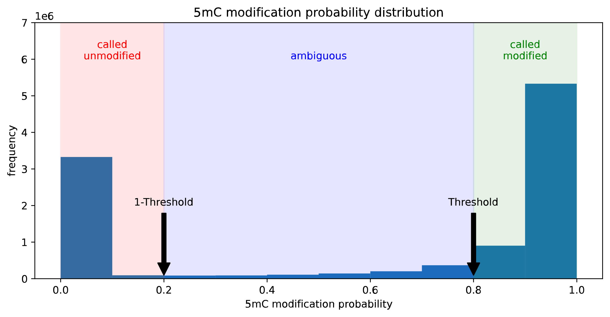

# minimod

Minimod is a simple tool for handling base modifications. It takes an aligned BAM file with modifications tags and the reference FASTA as inputs, and outputs base modifications (TSV) or base modification frequencies (TSV or bedmethyl).

Minimod reads base modification information encoded under `MM:Z` and `ML:B:C` SAM tags specified in [SAMtags](https://github.com/samtools/hts-specs/blob/master/SAMtags.pdf) specification.

**IMPORTANT: minimod is currently in active development. Open an [issue](https://github.com/warp9seq/minimod) if you find a problem or have a suggestion.**

[](https://github.com/warp9seq/minimod/releases)
[](https://anaconda.org/bioconda/minimod)

# Table of Contents
- [Quick start](#quick-start)
- [Installation](#installation)
  - [Building a release](#building-a-release)
- [Usage](#usage)
- [Examples](#examples)
- [minimod view](#minimod-view)
- [minimod freq](#minimod-freq)
- [minimod summary](#minimod-summary)
- [How skipped bases are handled](#how-skipped-bases-are-handled)
- [Modification codes and contexts](#modification-codes-and-contexts)
- [Modification probability](#modification-probability)
- [Modification threshold](#modification-threshold)
- [Enable insertions](#enable-insertions)
- [Enable haplotypes](#enable-haplotypes)
- [Important !](#important)
  - [Base-calling](#base-calling)
  - [Aligning](#aligning)
- [Acknowledgement](#acknowledgement)


# Quick start

If you are a Linux user and want to quickly try out download the compiled binaries from the [latest release](https://github.com/warp9seq/minimod/releases). For example:
```sh
VERSION=v0.5.0
wget "https://github.com/warp9seq/minimod/releases/download/$VERSION/minimod-$VERSION-x86_64-linux-binaries.tar.gz" && tar xvf minimod-$VERSION-x86_64-linux-binaries.tar.gz && cd minimod-$VERSION/
./minimod
```
Binaries should work on most Linux distributions as the only dependency is `zlib` which is available by default on most distributions. For compiled binaries to work, your operating system must have GLIBC 2.17 or higher (Linux distributions from 2014 onwards typically have this).

You can also use conda to install *minimod* as `conda install minimod -c bioconda -c conda-forge`.

# Installation
## Pre-requisites
```bash
sudo apt-get install zlib1g-dev  # install zlib development libraries
```
## Building a release
```bash
VERSION=v0.5.0
wget https://github.com/warp9seq/minimod/releases/download/$VERSION/minimod-$VERSION-release.tar.gz
tar xvf minimod-$VERSION-release.tar.gz
cd minimod-$VERSION/
scripts/install-hts.sh  # download and compile the htslib
make
```
> Major changes between releases are listed in [docs/changes.md](docs/changes.md)

# Usage
Usage information can be printed using ```minimod -h``` command.
```bash
Usage: minimod <command> [options]

command:
         view       view base modifications
         freq       output base modifications frequencies
         summary    output summary
```

Note: <i>freq</i> was previously <i>mod-freq</i> which still works but will be deprecated soon.

# Examples
```bash
# view all 5mC methylations at CG context in tsv format (default mod code: m, context:CG)
minimod view ref.fa reads.bam > mods.tsv

# 5mC methylation frequencies at CG context in tsv format (default mod code: m, threshold: 0.8, context:CG)
minimod freq ref.fa reads.bam > modfreqs.tsv

# 5mC methylation frequencies at CG context in bedmethyl format (default mod code: m, threshold: 0.8, context:CG)
minimod freq -b ref.fa reads.bam > modfreqs.bedmethyl

# modification frequencies of multiple types ( m (5-methylcytosine) and h (5-hydroxymethylcytosine) in CG context with thresholds 0.8 and 0.7 respectively )
minimod freq -c m[CG],h[CG] -m 0.8,0.7 ref.fa reads.bam > mods.tsv

# summary of available modifications and counts
minimod summary reads.bam > summary.tsv
```
- See [how modification codes can be specified?](#modification-codes-and-contexts)
- See [how threshold is used in minimod?](#modification-threshold)
- See [how minimod is consistent with other tools?](docs/notes.md)

# minimod view
```bash
minimod view ref.fa reads.bam > mods.tsv
```
This writes all base modifications (default modification code "m") to a file (mods.tsv) in tsv format. Sample output is given below.
```bash
Usage: minimod view ref.fa reads.bam

basic options:
   -c STR                     modification code(s) (eg. m, h or mh or as ChEBI) [m]
   -t INT                     number of processing threads [8]
   -K INT                     batch size (max number of reads loaded at once) [512]
   -B FLOAT[K/M/G]            max number of bases loaded at once [20.0M]
   -h                         help
   -p INT                     print progress every INT seconds (0: per batch) [0]
   -o FILE                    output file [stdout]
   --insertions               output modifications in insertions [no]
   --haplotypes               output haplotypes [no]
   --verbose INT              verbosity level [4]
   --version                  print version
   --allow-secondary          allow secondary alignments [no]
   --skip-supplementary       skip supplementary alignments [no]
```

- See [how to consider inserted modified bases?](#enable-insertions)

**Sample mods.tsv output**
The output is ordered in the same as the order the reads appear in the input BAM file, and for each read, entries are sorted by reference contig, reference position, strand, and modification code.
```bash
ref_contig	ref_pos	strand	read_id	read_pos	mod_code	mod_prob
chr22	19979864	+	m84088_230609_030819_s1/55512555/ccs	14	m	0.709804
chr22	19979882	+	m84088_230609_030819_s1/55512555/ccs	32	m	0.949020
chr22	19979885	+	m84088_230609_030819_s1/55512555/ccs	35	m	0.980392
chr22	19979888	+	m84088_230609_030819_s1/55512555/ccs	38	m	0.780392
chr22	19979900	+	m84088_230609_030819_s1/55512555/ccs	50	m	0.623529
chr22	19979902	+	m84088_230609_030819_s1/55512555/ccs	52	m	0.992157
chr22	19979929	+	m84088_230609_030819_s1/55512555/ccs	79	m	0.941176
chr22	19979939	+	m84088_230609_030819_s1/55512555/ccs	89	m	0.141176
chr22	19979948	+	m84088_230609_030819_s1/55512555/ccs	98	m	0.623529
```

| Field    | Type | Definition    |
|----------|-------------|-------------|
| 1. ref_contig | str | chromosome |
| 2. ref_pos   | int | position (0-based) of the base in reference |
| 3. strand | char | strand (+/-) of the read |
| 4. read_id | str | name of the read |
| 5. read_pos | int | position (0-based) of the base in read |
| 6. mod_code | char | base modification code as in [SAMtags: 1.7 Base modifications](https://github.com/samtools/hts-specs/blob/master/SAMtags.pdf)  |
| 7. mod_prob | float | probability (0.0-1.0) of base modification |
| 8. ins_offset | int | offset of inserted base from ref_pos (only output when --insertions is specified) |
| 9. haplotype | int | haplotype of the read (only output when --haplotypes is specified) |

# minimod freq
```bash
minimod freq ref.fa reads.bam > modfreqs.tsv
```
This writes base modification frequencies (default modification code "m" in CG context with modification threshold 0.8) to a file (modfreqs.tsv) file in tsv format.
```bash
Usage: minimod freq ref.fa reads.bam

basic options:
   -b                         output in bedMethyl format [not set]
   -c STR                     modification code(s) (eg. m, h or mh or as ChEBI) [m]
   -m FLOAT                   min modification threshold(s). Comma separated values for each modification code given in -c [0.8]
   -t INT                     number of processing threads [8]
   -K INT                     batch size (max number of reads loaded at once) [512]
   -B FLOAT[K/M/G]            max number of bases loaded at once [20.0M]
   -h                         help
   -p INT                     print progress every INT seconds (0: per batch) [0]
   -o FILE                    output file [stdout]
   --insertions               output modifications in insertions [no]
   --haplotypes               output haplotypes [no]
   --verbose INT              verbosity level [4]
   --version                  print version
   --allow-secondary          allow output secondary alignments [no]
   --skip-supplementary       skip supplementary alignments [no]
```

**Sample modfreqs.tsv output**
The output entries are sorted by reference contig, reference position, strand, and modification code.
```bash
contig	start	end	strand	n_called	n_mod	freq	mod_code
chr22	20016337	20016337	+	5	0	0.000000	m
chr22	20016594	20016594	+	2	0	0.000000	m
chr22	20017045	20017045	+	1	0	0.000000	m
chr22	19970705	19970705	+	1	0	0.000000	m
chr22	19981716	19981716	+	1	1	1.000000	m
chr22	20020909	20020909	+	3	0	0.000000	m
chr22	19995719	19995719	+	4	2	0.500000	m
chr22	20017060	20017060	+	1	0	0.000000	m
chr22	19971259	19971259	+	1	1	1.000000	m
```

| Field    | Type | Definition    |
|----------|-------------|-------------|
| 1. contig | str | chromosome |
| 2. start | int | position (0-based, inclusive) of the base |
| 3. end   | int | position (0-based, inclusive) of the base |
| 4. strand | char | strand (+/-) of the read |
| 5. n_called | int | number of reads called for base modification |
| 6. n_mod | int | number of reads with base modification |
| 7. freq | float | n_mod/n_called ratio |
| 8. mod_code | char | base modification code as in [SAMtags: 1.7 Base modifications](https://github.com/samtools/hts-specs/blob/master/SAMtags.pdf) |
| 9. ins_offset | int | offset of inserted base from ref_pos (only output when --insertions is specified) |
| 10. haplotype | int | haplotype of the read (only output when --haplotypes is specified) |

**Sample modfreqs.bedmethyl output**

```bash
chr22	20016387	20016388	m	4	-	20016387	20016388	255,0,0	4	0.000000
chr22	20016820	20016821	m	1	+	20016820	20016821	255,0,0	1	0.000000
chr22	19999255	19999256	m	7	+	19999255	19999256	255,0,0	7	0.000000
chr22	20016426	20016427	m	1	+	20016426	20016427	255,0,0	1	100.000000
chr22	19988365	19988366	m	1	-	19988365	19988366	255,0,0	1	100.000000
chr22	19988168	19988169	m	1	-	19988168	19988169	255,0,0	1	100.000000
chr22	20016904	20016905	m	1	+	20016904	20016905	255,0,0	1	0.000000
chr22	20011898	20011899	m	8	-	20011898	20011899	255,0,0	8	25.000000
chr22	19990123	19990124	m	3	+	19990123	19990124	255,0,0	3	0.000000
chr22	19982787	19982788	m	1	+	19982787	19982788	255,0,0	1	0.000000
```

| Field    | Type | Definition    |
|----------|-------------|-------------|
| 1. contig | str | chromosome |
| 2. start | int | position (0-based, inclusive) of the base |
| 3. end   | int | position (0-based, not inclusive) of the base |
| 4. mod_code | char | base modification code as in [SAMtags: 1.7 Base modifications](https://github.com/samtools/hts-specs/blob/master/SAMtags.pdf) |
| 5. n_mod | int | number of reads with base modification |
| 6. strand | char | strand (+/-) of the read |
| 7. start | int | = field 2 |
| 8. end   | int | = field 3 |
| 9. color | str | always 255,0,0 (for compatibility) |
| 10. n_mod | int | = field 5 |
| 11. freq | float | n_mod/n_called ratio |

# minimod summary

```bash
minimod summary reads.bam > summary.tsv
```
This writes all base modifications available to a file (summary.tsv) in tsv format. Sample output is given below.
```bash
Usage: minimod summary reads.bam

basic options:
   -t INT                     number of processing threads [8]
   -K INT                     batch size (max number of reads loaded at once) [512]
   -B FLOAT[K/M/G]            max number of bases loaded at once [20.0M]
   -h                         help
   -p INT                     print progress every INT seconds (0: per batch) [0]
   -o FILE                    output file [stdout]
   --verbose INT              verbosity level [4]
   --version                  print version
   --allow-secondary          allow secondary alignments [no]
   --skip-supplementary       skip supplementary alignments [no]

advanced options:
   --debug-break INT          break after processing the specified no. of batches
   --profile-cpu=yes|no       process section by section
```

**Sample mods.tsv output**
```bash
read_id	 modifications
491fb526-314e-4c18-9690-eb6930d780ea	A|17596|. C|m|. A|a|. C|19228|. T|19227|. A|69426|. G|19229|. T|17802|. 
52b66d0d-a21e-4334-be1b-f72486d9f9bf	A|17596|. C|m|. A|a|. C|19228|. T|19227|. A|69426|. G|19229|. T|17802|. 
cb481f14-7651-448c-945b-b4f5b2e8b70c	A|17596|. C|m|. A|a|. C|19228|. T|19227|. A|69426|. G|19229|. T|17802|. 
2cab7053-9008-47eb-8e57-c33fda56c2ec	A|17596|. C|m|. A|a|. C|19228|. T|19227|. A|69426|. G|19229|. T|17802|. 
37bf1305-8d8b-4973-9a0b-930303067306	A|17596|. C|m|. A|a|. C|19228|. T|19227|. A|69426|. G|19229|. T|17802|. 
164e336f-568d-44d5-882d-7669bbe67654	A|17596|. C|m|. A|a|. C|19228|. T|19227|. A|69426|. G|19229|. T|17802|. 
229bbbb9-abf9-4825-af30-a583a19864eb	A|17596|. C|m|. A|a|. C|19228|. T|19227|. A|69426|. G|19229|. T|17802|. 
adbaba61-604d-4897-99cc-f9a934f3e2c8	A|17596|. C|m|. A|a|. C|19228|. T|19227|. A|69426|. G|19229|. T|17802|. 
093bc2c6-2ae5-437d-a17c-be2755c3c689	A|17596|. C|m|. A|a|. C|19228|. T|19227|. A|69426|. G|19229|. T|17802|. 
92fc0cc5-b2d8-4cb1-bf25-8f8b88088f23	A|17596|. C|m|. A|a|. C|19228|. T|19227|. A|69426|. G|19229|. T|17802|. 
```
The output is ordered in the same as reads appear in the input BAM file. First column of the output are the read_id the second column contains all available modifications in that read as space separated entries. Each entry has the following format.
```
canonical_base(character such as ACGTN)|mod_code(character or ChEBI number)|status_flag(. or ?)
```

Status flag describes how skipped bases should be interpreted by downstream tools.
- **.** : skipped bases should be assumed to have low probability of modifications.
- **?** : there is no information about the modification status of skipped bases

# How skipped bases are handled
Modified base positions are encoded in MM tag as a series of integers each indicating how many bases to be skipped before the next modified base. For an example, if the MM tag starts with **C+m.**, the skipped bases should be considered to have low probability. Otherwise, if the MM tag starts with **C+m?**,  the probability of skipped bases are unknown. 

Minimod ignores skipped bases with unknown probability while considering each skipped bases with low probability to have mod_prob value of 0.001953125. This value is derived from (N+0.5)/256 where N equals to 0 as explained [Modification probability](#modification-probability) section.

# Modification codes and contexts
Base modification codes and contexts can be set for both view and freq tool using -c option to take only specific base modifications found in a given contexts. The context should match in the reference and bases in unmatching contexts are ignored.

Here are the possible context formats.
- **m[CG]** : type m modifications in CG context. the modified read base should match the corresponding reference base. the whole context may not match between read sequence and reference sequence.
- **m** : same as **m[CG]**.
- **a[A]** : same as **a**. type a modifications in A context. modified read base should match the corresponding reference base.
- **a[*]** : type a modifications regardless of the context in reference or read sequences. no modified read base to reference base matching.
- **\*[CG]** : all types of modifications in CG context. the modified read base should match the corresponding reference base. the whole context may not match between read sequence and reference sequence.
- **17802[T]** : pseU modifications in T context (modification code is given as ChEBI code). the modified read base should match the corresponding reference base. the whole context may not match between read sequence and reference sequence.
- **\*** :  any type of modifications in any context. no modified read base to reference base matching. 

Here are some example commands.
```bash
minimod view -c a[A],h[CG],m ref.fa reads.bam
minimod freq -c a[A],h[CG],m ref.fa reads.bam
minimod freq -c "*[CG]" ref.fa reads.bam
minimod freq -c "*" ref.fa reads.bam
minimof freq -c "17802[T]" ref.fa reads.bam
```

If the context is not specified in square brackets along with modification code, minimod will consider following default contexts. Following table is an extension of the modification codes table in ([SAMtags: 1.7 Base modifications](https://github.com/samtools/hts-specs/blob/master/SAMtags.pdf)).

| Unmodified base | Code | Abbreviation | Name | Default context |
| - | - | - | - | - |
| C | m | 5mC | 5-Methylcytosine | CG |
| C | h | 5hmC | 5-Hydroxymethylcytosine | CG |
| C | f | 5fC | 5-Formylcytosine | C |
| C | c | 5caC | 5-Carboxylcytosine | C |
| C | C |  | Ambiguity code; any C mod | C |
| T | g | 5hmU | 5-Hydroxymethyluracil | T |
| T | e | 5fU | 5-Formyluracil | T |
| T | b | 5caU | 5-Carboxyluracil | T |
| T | T |  | Ambiguity code; any T mod | T |
| U | U |  | Ambiguity code; any U mod | U |
| A | a | 6mA | 6-Methyladenine | A |
| A | A |  | Ambiguity code;any A mod | A |
| G | o | 8oxoG | 8-Oxoguanine | G |
| G | G |  | Ambiguity code; any G mod | G |
| N | n | Xao | Xanthosine | N |
| N | N |  | Ambiguity code; any mod | N |

## Supported and tested modifications

Minimod is expected to support standard modifications given in the table above and any other either given as modification code or ChEBI code in MM tag of the BAM record.
Note that we have done whole genome testing on 5mC and 6mA and some limited testing 5hmC. The others are only tested using small scale datasets. Following is a summary of tests we have performed. * is the wild card for both modification type and context in minimod.

### ONT
| DNA/RNA | mod+base called model | aligned to | tested modification[context] combinations |
| - | - | - | - |
| DNA | 5mCG_5hmCG | hg38 genome | m[CG], h[CG], m[C], h[C], m[\*], \*[\*] |
| DNA | 4mC_5mC | hg38 genome | m[CG], m[C], 21839[C], \*[\*] |
| DNA | 5mC_5hmC | hg38 genome | m[CG], h[CG], m[C], h[C], m[\*], \*[\*] |
| DNA | 6mA | hg38 genome | a[A], a[\*], \*[\*] |
| RNA | 2OmeG | hg38 genome | 19229[G], 19229[\*], \*[\*] |
| RNA | inosine_m6A_2OmeA | hg38 genome | 69426[A], a[A], 17596[A], \*[\*] |
| RNA | m5C_2OmeC | hg38 genome | 19228[C], m[C], \*[\*] |
| RNA | m6A_DRACH | hg38 genome | a[A], \*[\*] |
| RNA | pseU_2OmeU | hg38 genome | 19227[T], 17802[T], \*[\*] |
| RNA | multiple: m5C_2OmeC, inosine_m6A_2OmeA, pseU_2OmeU, 2OmeG | hg38 genome | 17596[A], \*[\*] |
| RNA | 2OmeG | gencode.v40 transcriptome | 19229[G], 19229[\*] |
| RNA | inosine_m6A_2OmeA | gencode.v40 transcriptome | 69426[A], a[A], 17596[A] |
| RNA | m5C_2OmeC | gencode.v40 transcriptome | 19228[C], m[C], \*[\*] |
| RNA | m6A_DRACH | gencode.v40 transcriptome | a[A], \*[\*] |
| RNA | pseU_2OmeU | gencode.v40 transcriptome | 19227[T], 17802[T], \*[\*] |
| RNA | multiple: m5C_2OmeC, inosine_m6A_2OmeA, pseU_2OmeU, 2OmeG | gencode.v40 transcriptome | 69426[A], \*[\*] |

### Pacbio
| DNA/RNA | aligned to | tested modification[context] combinations |
| - | - | - |
| DNA | hg38 genome | m[CG] |


> Note: Be mindful when working with modification types and context combinations that we have not tested and please feel free to open an [issue](https://github.com/warp9seq/minimod/issues), if you experience any problem.

# Modification probability
According to [SAMtags: 1.7 Base modifications: ML](https://github.com/samtools/hts-specs/blob/master/SAMtags.pdf), modifcation probabilities given in ML tag is a 8-bit unsigned integer. It maps 0.0 to 1.0 continuous probability range to discrete integers range 0-255. A discrete value N represents a continuous probability range N/256 to (N+1)/256. Therefore, as it is reasonable to choose the mid point of that range, Minimod computes the continuous probability, p when the 9-bit unsigned interger is N as follows.

$p=(N+0.5)/256 $ 


# Modification threshold
Base modification threshold can be set for freq tool using -m option.


01. 5mC modification(default context :CG) frequencies with threshold 0.8
> ```
>   minimod freq -c m -m 0.8 ref.fa reads.bam
> ```

> ```
> If p(5mC) >=  0.8 (threshold),       called(5mC) and modified(5mC)
> If p(5mC) <=  0.2 (1-threshold),     called(5mC)
> else,                                ignored as ambiguous
>
> freq(5mC) = total_modified(5mC)/total_called(5mC)
> ```

03. 5mC and 5hmC base modification(default context :CG) frequencies with thresholds 0.8, 0.7 respectively
> ```
>   minimod freq -c m,h -m 0.8,0.7 ref.fa reads.bam
> ```

> ```
> If p(5mC)  >=  0.8 (threshold),      called(5mC) and modified(5mC)
> If p(5mC)  <=  0.2 (1-threshold),    called(5mC)
> else,                                ambiguous
>
> freq(5mC) = total_modified(5mC)/total_called(5mC)
> ```

> ```
> If p(5hmC) >=  0.7 (threshold),      called(5hmC) and modified(5hmC)
> If p(5hmC) <=  0.3 (1-threshold),    called(5hmC)
> else,                                ignored as ambiguous
>
> freq(5hmC) = total_modified(5hmC)/total_called(5hmC)
> ```

# Enable insertions
minimod can handle inserted modified bases (where canonical base in not in reference) by specifying --insertions flag for both freq and view tools.

Specifying --insertions will add an extra ins_offset column(**only in tsv output**) which is the position of modified base within the inserted region.

The context matching and base matching are ignored when reporting modified bases in inserted region due to the lack of a aligned reference site.

**Sample output of view with --insertions**

```bash
$ minimod view --insertions ref.fa reads.bam

ref_contig	ref_pos	strand	read_id	read_pos	mod_code	mod_prob	ins_offset
chr22	19967897	+	89870c83-8790-419f-acf8-8a8e93a0f3c9	1396	m	0.537255	0
# chr22	19968083	+	89870c83-8790-419f-acf8-8a8e93a0f3c9	1582	m	0.000000	2
chr22	19968225	+	89870c83-8790-419f-acf8-8a8e93a0f3c9	1722	m	0.105882	0
chr22	19968330	+	89870c83-8790-419f-acf8-8a8e93a0f3c9	1826	m	0.505882	0
chr22	19968390	+	89870c83-8790-419f-acf8-8a8e93a0f3c9	1885	m	0.960784	0
chr22	19968435	+	89870c83-8790-419f-acf8-8a8e93a0f3c9	1930	m	0.917647	0
```

**Sample output of freq with --insertions**
```bash
$ minimod freq --insertions ref.fa reads.bam

contig	start	end	strand	n_called	n_mod	freq	mod_code	ins_offset
chr22	19981825	19981825	-	1	1	1.000000	m	0
# chr22	19968083	19968083	+	1	0	0.000000	m	2
chr22	20014485	20014485	+	1	1	1.000000	m	0
chr22	20017214	20017214	-	1	0	0.000000	m	0
chr22	20004425	20004425	+	2	2	1.000000	m	0
chr22	20016700	20016700	-	4	0	0.000000	m	0
```
Highlighted line corresponds to a 5mC modification within an insertion (A mC G) at position 19968083

# Enable haplotypes
minimod can output the haplotype in a separate integer column (**only in tsv output**) by specifying --haplotypes flag for both view and freq tools. minimod does **not** compute or infer haplotypes. Instead, it uses haplotype assignments already present in the input BAM, if the BAM is phased and contains the [`HP` (Haplotype)](https://samtools.github.io/hts-specs/SAMtags.pdf) tag.

**Sample output of view with --haplotypes**
```bash
$ minimod view --haplotypes ref.fa reads.bam

ref_contig	ref_pos	strand	read_id	read_pos	mod_code	mod_prob	haplotype
chr1	10484	-	m84088_240522_013656_s1/164692234/ccs	16262	m	0.980392	2
chr1	10471	-	m84088_240522_013656_s1/164692234/ccs	16275	m	0.772549	2
chr1	10469	-	m84088_240522_013656_s1/164692234/ccs	16277	m	0.254902	2
chr1	25115	-	m84088_240522_013656_s1/197203096/ccs	0	m	0.290196	1
chr1	25059	-	m84088_240522_013656_s1/197203096/ccs	56	m	0.886275	1
chr1	24926	-	m84088_240522_013656_s1/197203096/ccs	189	m	0.988235	1
```
**Sample output of freq with --haplotypes**

```bash
$ minimod freq --haplotypes ref.fa reads.bam

contig	start	end	strand	n_called	n_mod	freq	mod_code	haplotype
chr1	23002	23002	-	3	3	1.000000	m	1
chr1	23002	23002	-	3	3	1.000000	m	2
chr1	23002	23002	-	6	6	1.000000	m	*
chr1	23096	23096	+	1	0	0.000000	m	1
chr1	23096	23096	+	3	3	1.000000	m	2
chr1	23096	23096	+	4	3	0.750000	m	*
```

freq value of modifications with haplotype=* is calculated taking modifications from all haplotypes

# Important !
Make sure that you handle the modification tags correctly in each step in base modification calling pipeline (e.g., providing both `-y` and `-Y` to minimap2). See the example pipeline that we use below.

## Base-calling
- Use a basecalling model trained to identify modified bases.

   Example: Base-calling a slow5 file using [buttery-eel](https://github.com/Psy-Fer/buttery-eel)
   ```
   buttery-eel --call_mods --config dna_r10.4.1_e8.2_400bps_5khz_modbases_5hmc_5mc_cg_hac.cfg -i reads.slow5 -o reads.sam -g path/to/guppy/bin
   samtools fastq -TMM,ML reads.sam > reads.fastq
   ```

## Aligning
- Use soft clipping for supplementary alignments

   Corresponding minimap2 flags are as follows.
   | Minimap2 Flag | Description |
   |-|-|
   |-Y | Use soft clipping for supplementary alignments |
   |-y | Copy input FASTA/Q comments to output |

   Example: aligning ONT reads using [minimap2](https://github.com/lh3/minimap2)
   ```
   minimap2 -ax map-ont -Y -y ref.idx reads.fastq
   ```

- If more than 90% of the reads in the BAM file are skipped due to various reasons (unmapped, 0 length, or missing MM/ML tags), minimod prints a warning message. However, if all of them are skipped minimod errors out.
- If hard clipped non-primary alignments are found, minimod errors out. (to filter out non-primary alignments: ```samtools view -h -F 2308 reads.bam -o primary_reads.bam``` or use minimap2 with -Y to use soft clipping).

# Acknowledgement

Minimod uses [klib](https://github.com/attractivechaos/klib). Some code snippets have been taken from [Minimap2](https://github.com/lh3/minimap2) and [Samtools](http://samtools.sourceforge.net/).

# Citation

> Samarasinghe, S., Deveson, I., Gamaarachchi, H., 2025. Base modification analysis in long read sequencing data using Minimod. https://doi.org/10.1101/2025.07.16.665072

```
@article{samarasinghe_base_2025,
  title = {Base modification analysis in long read sequencing data using {Minimod}},
  author = {Samarasinghe, Suneth and Deveson, Ira and Gamaarachchi, Hasindu},
  year={2025},
  publisher={bioRxiv}
}
```